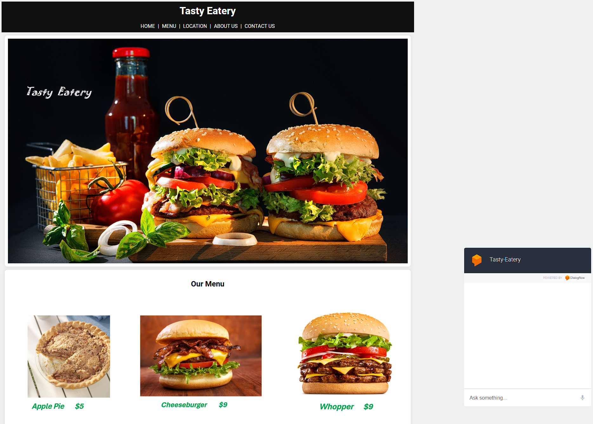
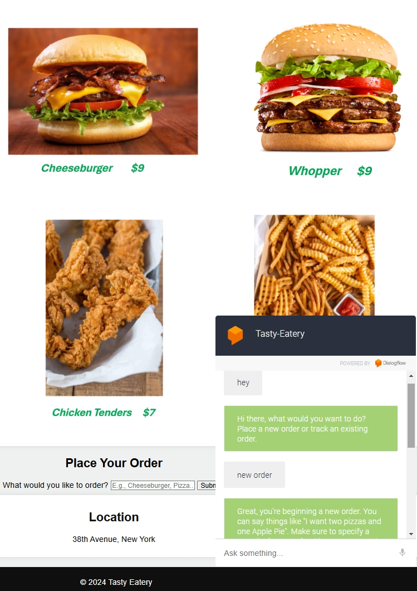

# Tasty Eastery After-Hours Chat Bot

Tasty Eastery Chat Bot is an intelligent assistant powered by Google's Dialogflow - ES, designed to enhance user interaction on the Tasty Eastery website. This chatbot seamlessly guides users in making online orders during closing hours, ensuring a smooth and efficient customer experience even when the restaurant is not actively open.
## Structure

- [Frontend](https://github.com/PrxncE-LixH/Chat-bot-with-Diagflow/tree/master/frontend)
- [Chatbot](https://github.com/PrxncE-LixH/Chat-bot-with-Diagflow/blob/master/Tasty-Eatery.zip)
- [Backend](https://github.com/PrxncE-LixH/Chat-bot-with-Diagflow/blob/master/backend/main.py)
- [Database](https://github.com/PrxncE-LixH/Chat-bot-with-Diagflow/tree/master/backend/database)

## License


[](https://choosealicense.com/licenses/mit/)

## Authors

- [PrxncE-LixH](https://github.com/PrxncE-LixH)


## Installation
- Frontend

```
index.html
```

- chatbot
```
Chatbot logic is located at 
https://github.com/PrxncE-LixH/Chat-bot-with-Diagflow/blob/master/Tasty-Eatery.zip 
```
Download and import as a new diaglog flow project.  


- Backend

  Install dependancies
  ```
  pip install -r requirements.txt
  ```


- Start server
  ```
  uvicorn main:app --reload
  python -m uvicorn main:app --reload    if you're on windows 
  ```
    
Google only allows HTTPS connections. To reach the chatbot api, you will need to generate a self-signed certificate with openssl. Refer to https://www.youtube.com/watch?v=P5mdDTMmfL0&list=PLmiXwP1ZU2Fd3KxbA6LvulUs5j8BUDXX0 for assistance. 

To run locally with HTTPS without a signed certificate, you can use Ngrok. Refer to 
https://www.youtube.com/watch?v=aFwrNSfthxU to install and set it up.
```
ngrok http 8000
```
- Goto Fulfillment on your Diagflow project, enable webhooks and replace the url with the new Ngrok url.


## Database

An SQL Database was used locally for the process. Database file is located at https://github.com/PrxncE-LixH/Tasty_Eatery_Dialogflow/tree/main/database. 

It is assumed you already have XAMPP, mysql, and MySQL Workbench 8.0 set up. Refer to https://www.youtube.com/watch?v=2ydHLNnGIVI for assistance. 

- Create a connection in MySQL Workbench, click on the server tab and data import. Import the attached database file and set it as the default schema. The database file has the names and prices of food items. It also generates and stores Order IDs needed for tracking.  
  

## How to run

- Start XAMPP (APACHE, MYSQL) and MySQL Workbench 8.0 
- Run backend server
- Start Ngrok and generate an HTTPS url- Ngrok should be in the same directory as the backend server file. 
- Enable webhooks on Diagflow and replace the url with the new Ngrok url.
- Start frontend

- 
## Demo







